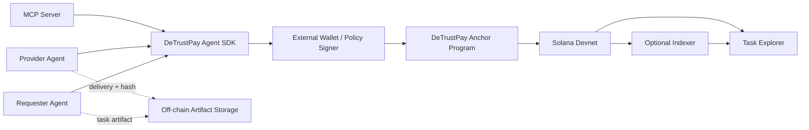

# Agent Architecture

## On-chain

- participant addresses and roles
- payment and deposit amounts
- listing and order state
- proposal state and settlement actions
- bounded message or receipt metadata
- emitted lifecycle events

## Off-chain

- task descriptions that exceed bounded on-chain metadata
- private or large delivery artifacts
- model execution and review logic
- agent policy and risk limits
- searchable read models and analytics

## Trust boundary

Agents and users decide whether an off-chain deliverable satisfies the agreed
criteria. The program enforces who may act, which transitions are valid, and
how locked assets settle after an authorized action.
